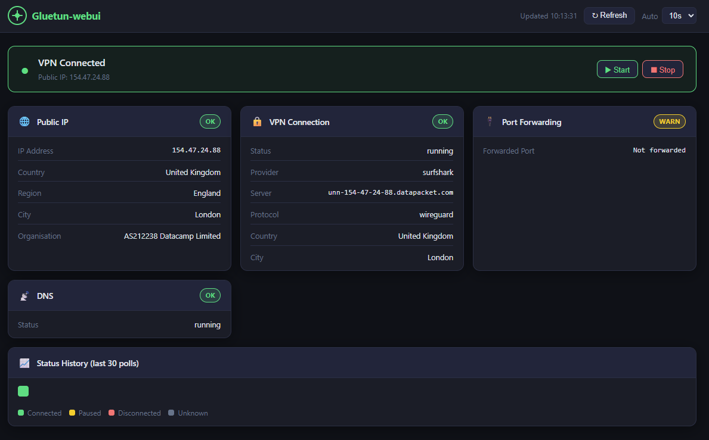

# Gluetun WebUI

This is NOT my work, all congratulation to @Sir-Scuzza  ->  https://github.com/Sir-Scuzza/gluetun-webui
I just use IA to adapt to MY needs....

A lightweight web UI for monitoring and controlling [Gluetun](https://github.com/qdm12/gluetun) — the VPN client container for Docker.


---

## Features

- Live VPN status banner (connected / paused / disconnected)
- Public exit IP, country, region, city, and organisation
- VPN provider, protocol (WireGuard / OpenVPN), server details
- Port forwarding and DNS status
- Start / Stop VPN controls
- Auto-refresh with configurable interval (5s – 60s)
- Last 30 poll ticks colour-coded in history bar

---

## Screenshots


---

## Requirements

- Docker + Docker Compose
- Gluetun running with its HTTP control server enabled (default port `8000`)
- Gluetun and gluetun-webui on the same Docker network

> Supports `linux/amd64` and `linux/arm64` (works on Mac Intel/Apple Silicon, Linux, and Windows).

---

## Quick Start

This is a customised fork — there is no pre-built Docker Hub image for it.
You must **build the image locally** from this repository so that your modifications are included.

```bash
git clone https://github.com/pinkfloydFR/gluetun-webui.git
cd gluetun-webui
docker compose -f docker-compose.example.yml up -d --build
```

The UI is available at **http://localhost:3000**

> **Why build locally?**  Using a pre-built image from the original upstream project (`scuzza/gluetun-webui`) would run the unmodified original code and ignore all changes made in this fork. Building with `--build` compiles the image from the local `Dockerfile` so every customisation is included.

---

## Integrating into an existing Docker Compose

If you already have a Docker Compose file that runs Gluetun, follow these steps to add gluetun-webui to it.

### 1 — Clone the repository

```bash
git clone https://github.com/pinkfloydFR/gluetun-webui.git /opt/gluetun-webui
```

### 2 — Add the service to your existing `docker-compose.yml`

In the `services:` block, add:

```yaml
  gluetun-webui:
    build: /opt/gluetun-webui   # path to where you cloned the repo
    container_name: gluetun-webui
    ports:
      - "127.0.0.1:3000:3000"
    environment:
      # ── Single Gluetun instance (legacy, still supported) ────────────────
      - GLUETUN_CONTROL_URL=http://gluetun:8000   # service name of your gluetun container
      # Optional — only needed if Gluetun has auth enabled:
      #- GLUETUN_API_KEY=yourtoken

      # ── Two Gluetun instances (recommended when you run two containers) ──
      # Comment the legacy variables above and uncomment these instead:
      #- GLUETUN_1_NAME=Gluetun 1
      #- GLUETUN_1_URL=http://gluetun-1:8000
      #- GLUETUN_1_API_KEY=token_for_instance_1
      #- GLUETUN_2_NAME=Gluetun 2
      #- GLUETUN_2_URL=http://gluetun-2:8000
      #- GLUETUN_2_API_KEY=token_for_instance_2
    networks:
      - your_gluetun_network     # must be the same network as your gluetun service
    restart: unless-stopped
    read_only: true
    tmpfs:
      - /tmp
    security_opt:
      - no-new-privileges:true
    cap_drop:
      - ALL
    healthcheck:
      test: ["CMD", "wget", "-qO-", "http://localhost:3000/api/health"]
      interval: 30s
      timeout: 5s
      start_period: 10s
      retries: 3
    logging:
      driver: "json-file"
      options:
        max-size: "50m"
        max-file: "3"
```

### 3 — Start (and build) only the new service

```bash
docker compose up -d --build gluetun-webui
```

The `--build` flag compiles the image from the local `Dockerfile`; the other
services in your compose file are not restarted.

### Full example (two Gluetun instances)

```yaml
services:

  gluetun-fr:
    image: qmcgaw/gluetun
    # … your existing gluetun config …
    networks:
      - arr-stack

  gluetun-us:
    image: qmcgaw/gluetun
    # … your existing gluetun config …
    networks:
      - arr-stack

  gluetun-webui:
    build: /opt/gluetun-webui
    container_name: gluetun-webui
    ports:
      - "127.0.0.1:3000:3000"
    environment:
      - GLUETUN_1_NAME=Gluetun FR
      - GLUETUN_1_URL=http://gluetun-fr:8000
      #- GLUETUN_1_API_KEY=token_for_instance_1   # only if Gluetun has API key auth enabled
      - GLUETUN_2_NAME=Gluetun US
      - GLUETUN_2_URL=http://gluetun-us:8000
      #- GLUETUN_2_API_KEY=token_for_instance_2   # only if Gluetun has API key auth enabled
    networks:
      - arr-stack
    restart: unless-stopped
    read_only: true
    tmpfs:
      - /tmp
    security_opt:
      - no-new-privileges:true
    cap_drop:
      - ALL

networks:
  arr-stack:
    driver: bridge
```

---

## Network Setup

Both Gluetun and gluetun-webui must be on the same Docker network so `http://gluetun:8000` resolves correctly.

**Same compose file** — just add both services to the same network (most common):

```yaml
services:
  gluetun:
    networks:
      - arr-stack
  gluetun-webui:
    networks:
      - arr-stack

networks:
  arr-stack:
    driver: bridge
```

**Separate compose files** — reference Gluetun's existing network as external. Find your network name with `docker network ls`:

```yaml
networks:
  ext-network:
    external: true
    name: your_gluetun_network_name
```

---

## Configuration

### Two-instance mode (recommended)

| Variable | Default | Description |
|---|---|---|
| `GLUETUN_1_NAME` | `Gluetun 1` | Display name for instance 1 |
| `GLUETUN_1_URL` | _(from `GLUETUN_CONTROL_URL`)_ | Gluetun HTTP control server URL for instance 1 |
| `GLUETUN_1_API_KEY` | _(from `GLUETUN_API_KEY`)_ | Bearer token for instance 1 (if API key auth is enabled) |
| `GLUETUN_2_NAME` | `Gluetun 2` | Display name for instance 2 |
| `GLUETUN_2_URL` | _(empty)_ | Gluetun HTTP control server URL for instance 2 (leave empty to show as unavailable) |
| `GLUETUN_2_API_KEY` | _(empty)_ | Bearer token for instance 2 (if API key auth is enabled) |
| `PORT` | `3000` | Port the web UI listens on |

### Legacy single-instance variables (still supported)

| Variable | Default | Description |
|---|---|---|
| `GLUETUN_CONTROL_URL` | `http://gluetun:8000` | Gluetun HTTP control server URL (maps to instance 1 if `GLUETUN_1_URL` is not set) |
| `GLUETUN_API_KEY` | _(empty)_ | Bearer token (maps to instance 1 if `GLUETUN_1_API_KEY` is not set) |

> **Note:** The UI always shows two fixed columns. If instance 2 is not configured (`GLUETUN_2_URL` is empty), the second column remains visible but shows "Not Configured".

---

## Security

- Port is bound to `127.0.0.1` — not exposed to the network
- Container runs as non-root with read-only filesystem and dropped capabilities
- Rate limiting applied to all API routes
- Upstream error details are logged server-side only — generic messages returned to the browser

### Reverse-proxy authentication

The VPN start/stop controls have no built-in authentication. If you expose the UI beyond localhost, place it behind a reverse proxy with HTTP Basic auth.

**Caddy** (`Caddyfile`):
```
your.domain.com {
  basicauth {
    user $2a$14$<bcrypt-hash>
  }
  reverse_proxy localhost:3000
}
```
Generate a hash with: `caddy hash-password`

**Nginx** (`nginx.conf`):
```nginx
location / {
  auth_basic "Restricted";
  auth_basic_user_file /etc/nginx/.htpasswd;
  proxy_pass http://localhost:3000;
}
```
Generate a password file with: `htpasswd -c /etc/nginx/.htpasswd user`

**Traefik** (Docker labels):
```yaml
labels:
  - "traefik.enable=true"
  - "traefik.http.routers.gluetun-webui.rule=Host(`your.domain.com`)"
  - "traefik.http.routers.gluetun-webui.middlewares=auth"
  - "traefik.http.middlewares.auth.basicauth.users=user:$$apr1$$<hash>"
```
Generate a hash with: `htpasswd -nb user password`

---

## Acknowledgments

- **[Gluetun](https://github.com/qdm12/gluetun)** — The VPN client container this webui was built for
- **[gluetun-monitor](https://github.com/csmarshall/gluetun-monitor)** — Great monitoring tool to pair with this webui
- **AI-Assisted Development** — This project was built with AI assistance

---

## License

MIT
